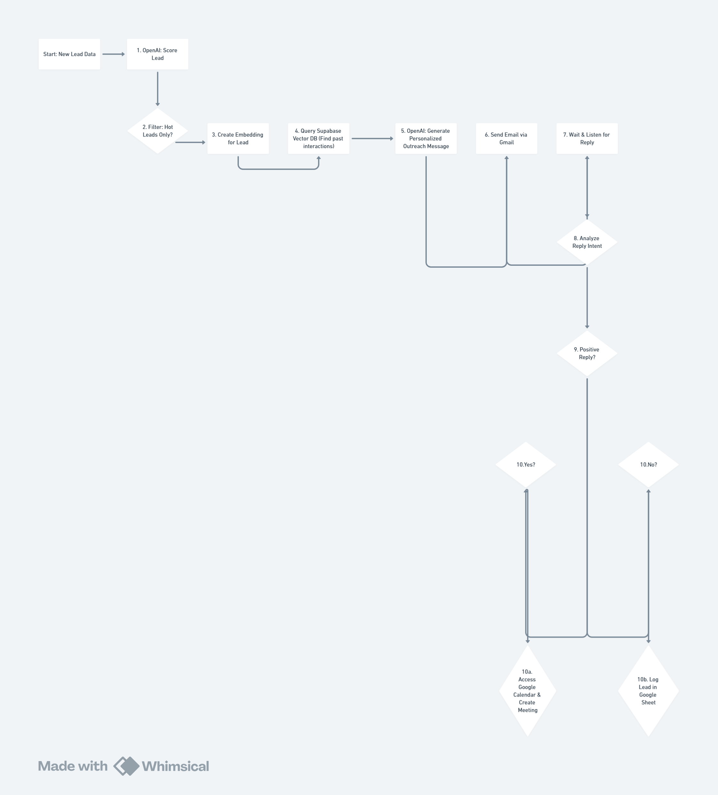

# 🤖 Autonomous AI Sales Agent in n8n

### Low-Code Agentic Workflow for Intelligent Lead Outreach

This repository documents an autonomous AI sales agent built entirely on the n8n low-code platform. This project showcases how to orchestrate multiple AI models and APIs to create a sophisticated agent that can perceive, reason, and act on business data to drive sales growth.

---

## 1. The Business Problem
Sales teams often get bogged down by the slow, manual, and repetitive process of qualifying and contacting new leads. This leads to valuable time being spent on low-value tasks instead of actual conversations, and hot leads are often missed due to human delay. Standard automation also lacks the true personalization needed for high engagement.

## 2. The Solution: An Autonomous Agent
I designed and built an automated agentic workflow in n8n that works 24/7 to solve this problem. This agent autonomously handles the entire lead outreach process, from initial qualification and personalized emailing to analyzing responses and booking meetings directly on a calendar.

### Workflow Architecture
This diagram illustrates the four key phases of the agent's decision-making process.

---

## 3. Tech & Skills Showcase
This project demonstrates the ability to orchestrate a complex series of tools to create a single, intelligent system.

-   **Automation Platform:** [**n8n.io**](https://n8n.io/)
-   **Core AI Logic:** OpenAI (for lead scoring, text generation, and intent analysis)
-   **Long-Term Memory (RAG):** Supabase (as the vector database for storing and retrieving past interactions)
-   **Execution Tools:** Google Workspace APIs (Gmail for sending emails, Google Calendar for booking meetings, Google Sheets for logging data)
-   **Architecture:** Agentic AI, Workflow Automation, API Integration

---

## 4. Key Features & Impact
This autonomous agent provides significant value by moving beyond simple automation.

-   ✅ **Fully Autonomous:** Works 24/7 without human intervention to ensure no lead is missed.
-   ✅ **Hyper-Personalized:** Uses a RAG pipeline to reference past interactions, making each outreach email unique and context-aware.
-   ✅ **Efficient & Scalable:** Frees up the sales team to focus exclusively on high-value conversations with pre-booked, qualified leads.
-   ✅ **Intelligent Decision-Making:** Uses AI to analyze human replies and autonomously decides on the correct next action.